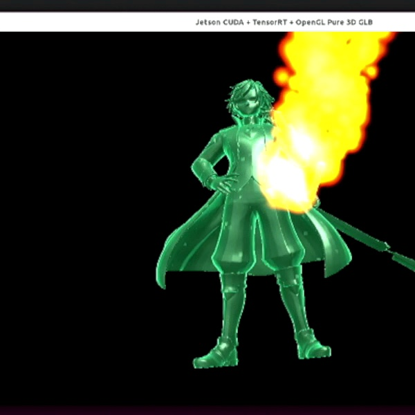

# Jetson CUDA + TensorRT + OpenGL GLB 3D Effects Demo

  

Real-time YOLO detection triggers animated GLB 3D Fire/Ice effects on Jetson using CUDA matrix actions and OpenGL shaders.

This repository is a public preview for my Early Access source code kit.

  <a href="https://5056721140525.gumroad.com/l/jetson-3d-glb-effects">
    <b>Get the Early Access Source Code Kit on Gumroad</b>
  </a>

## Demo Pipeline

Camera Input  
→ TensorRT YOLO Detection  
→ CUDA Matrix Action Logic  
→ OpenGL GLB Rendering  
→ Fire / Ice 3D Effects

## Full Source Code Kit

The full Early Access source code package is available on Gumroad:

https://5056721140525.gumroad.com/l/jetson-3d-glb-effects

This is an Early Access developer source code kit, not a polished one-click consumer application.

## Current AI-to-Effect Mapping

| Detection Result | 3D Effect | Matrix Action | Status |
|---|---|---|---|
| person | Ice Freeze | Defensive / frozen motion | Available |
| cell phone | Fire Burst | Energy / fire motion | Available |
| book | Knowledge Matrix Aura | Floating / dimension matrix motion | Planned |

## Tech Stack

- Jetson Orin Nano / Jetson Orin Nano Super
- CUDA
- TensorRT
- OpenGL
- GLB 3D model rendering
- V4L2 camera pipeline
- YOLO object detection
- C++ multi-threading

## Roadmap

- Demo Mode without camera or TensorRT engine
- Book detection → Knowledge Matrix Aura
- CUDA particle system
- Bloom post-processing
- Configurable AI-to-effect mapping
- Desktop NVIDIA GPU version

## Note

This repository is a public preview only.  
The full Early Access source code package is distributed through Gumroad.
